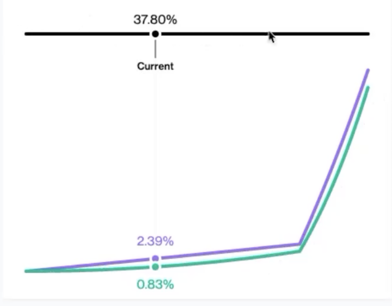
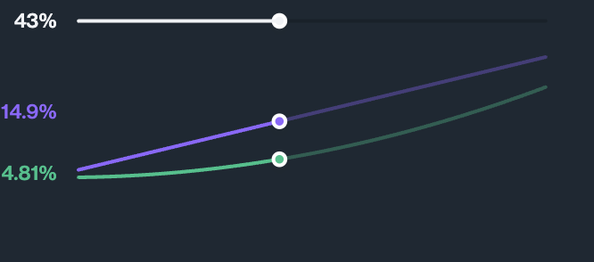
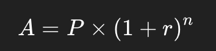

Compound II 于 2019 年上线，Compound III 则是今年 8 月份刚上线
白皮书：https://compound.finance/documents/Compound.Whitepaper.pdf
文档
- Compound II：https://docs.compound.finance/v2/
- Compound III：https://docs.compound.finance/
  Github
- Compound II：https://github.com/compound-finance/compound-protocol
- Compound III：https://github.com/compound-finance/comet

# **概念解析**

- Underlying Token: 基础资产/标的资产，即借贷资产，比如 ETH、USDT、USDC、WBTC 等，目前开设了 17 种借贷资产。
- cToken: 也称为生息代币，是用户在 Compound 上存入资产的凭证。每一种借贷资产都有对应的一种 cToken，比如，ETH 对应 cETH，USDT 对应 cUSDT，当用户向 Compound 存入 ETH 则会返回 cETH。取款时就可以用 cETH 换回 ETH。
- Exchange Rate: cToken 与借贷资产的兑换比例，比如 cETH 的兑换率为 0.02，即 1 个 cETH 可以兑换 0.02 个 ETH。通常情况下，兑换率会随着时间推移不断上涨，因此，持有 cToken 就等于不断生息，所以也才叫生息代币。
- Borrow Rate: 区块粒度的借款利率
- Supply Rate: 区块粒度的存款利率
- Utilization Rate: 资金使用率
- Collateral Factor: 抵押因子，也称为抵押率
- reserveFactor: 储备金率
- Liquidator: 清算人，一般为承担清算职责的机器人，目前普遍都是 MEV
- Close Factor: 最高可清算比例，目前设置为了 50%

超额抵押：抵押资产价值要大于借贷资产价值
全仓：并且用户所有的抵押资产和借贷资产是全部汇总一起计算总价值的，计算总抵押资产时候，不同资产根据自己的抵押率来计算抵押价值，最后汇总。
ETH 1000 _ 85%（ETH抵押率） + BTC 2000 _ 83%（BTC抵押率） = 2510 USD 可抵押金额

# **利率模型**

可避免资金枯竭，当资金利用率高的时候，借款利率上升，借款人少，防止资金枯竭。储备金 reserves 同时能够防止挤兑。

- 当 U≤Ukink：
r=rbase+slope×U
当前的借款利率 = 基础利率 + 斜率 × 利用率
borrowRate = multiplier * utilizationRate + baseRate
- 当 U>Ukink：
r=rbase+slope1×Ukink+slope2×(U−Ukink)
borrowRate = (multiplier * kink + baseRate) +   jumpMultiplier * (utilizationRate - kink)

- r=rbase+Slope×U  
当前的借款利率 = 基础利率 + 斜率 × 利用率
borrowRate = multiplier * utilizationRate + baseRate

  
利率模型是根据供需关系来计算的，利率模型是有两种模式的，每个币种都有自己的基础利率和斜率 ，并且拐点型利率模型同币种的斜率不一样

利用率（U）：当前市场资金使用率。表示某个市场的借款需求与供应的比例，越高的利用率意味着借款需求越大，利率会随着利用率增加而上升

资金利用率 utilizationRate = borrows / (cash + borrows - reserves)

资金利用率 = 总借款（包括每次结算的利息）  / （当前池子剩余资产+总借款-储备金（项目方收取的结算利息））

存款利率  r = rb × U × (1−R)

supplyRate = utilizationRate * borrowRate * (1 - reserveFactor)

存款利率 =  资金利用率 × 借款利率 ×(1−储备因子)

# **CToken 核心合约**

accrueInterest() 利率结算方法，系统核心结算函数
在可能的方法入口处以区块为时间单位进行利率结算，更新利率，相同块只做一次更新。

- 利率计算

    simpleInterestFactor = borrowRate * blockDelta（blockDelta为经过多少块）   
    
    上一次结算区块到本次结算区块，每单位区块借款利率。单位借款的这段时间产生了多少利息
    
    interestAccumulated = simpleInterestFactor * totalBorrows
    
    经过这段时间借款总共产生了多少利息，totalBorrows 为上一次更新时所有用户的借款总量。实际新增记账总利息
    
    totalBorrowsNew = interestAccumulated + totalBorrows
    
    原有借款本金 + 这段时间的利息 。借款总额更新（包含储备金 totalReserves）
    
    totalReservesNew = interestAccumulated * reserveFactor + totalReserves

    协议储备金更新，实际新增记账总利息需要给到一部分到储备金
    
    borrowIndexNew = simpleInterestFactor * borrowIndex + borrowIndex
    
    借款指数，跟上次相比，我的利息增加了多少百分点，复利的增长。帮助每个用户记录自己的“利息累积历史”，避免每次都去更新所有人的状态。 这里用到了一个 复利模型 ， borrowIndex 表示单位本金累积后的“倍数” ，增长因子

- 复利模型
复利的基本公式是：
[图片]
复利增长通常表示为：borrowIndexnew=borrowIndexold×(1+simpleInterestFactor)
-假设：
  - 初始 borrowIndex = 1.00e18
  - 现在 borrowIndex = 1.05e18 （5% 增长）
    利息增长倍数 = 1.05 / 1.00 = 1.05  
    应还 = principal × 1.05 
- 个人借款利息的计算

    每次用户结算的时候都有一个结算快照，BorrowSnapshot，下次计算的时候可以直接通过快照和 增加因子 interestIndex来计算，并且更新 结算快照

    struct BorrowSnapshot {
    
    uint principal;  // 用户上次操作后所欠的本金 + 利息 = 总借款
    
    uint interestIndex; // 当时的 borrowIndex 快照
    
    }
    
    个人借款利息直接结算到借款金额上
    
    recentBorrowBalance = borrower.borrowBalance * market.borrowIndex / borrower.borrowIndex
    
    借款总金额 = 上次借款总金额 * 市场当前增长因子 / 上次借款增长因子  （增长因子 = 借款指数）
    
    如果要算借款总金额里面借款金额和利息分别是多少，目前是合约层面没有单独计算开始的借贷金额是多少，这部分只能通过链下计算的；

- 个人存款利息的计算 exchangeRateStored()

    
    存款利息通过兑换率体现，exchangeRate（兑换率） 表示：1 个 cToken 现在能兑换多少底层资产。
    
    它随时间会增长（因为借款人支付利息），表示存款人的资产价值变多了。
    
    exchangeRate = (totalCash + totalBorrows - totalReserves) / totalSupply
    
    兑换率 = （当前池子总金额 + 总借款 — 储备金）/ ctoken 总供应量
    
    underlyingAmount = cTokenAmount * exchangeRate
    
    资产数量  =  ctoken数量 * 兑换率（一个 cToken 可兑换多少 underlying token）
    
    如果你是存款用户，存的是 DAI，那你的 underlyingAmount 就是你现在通过ctoken可以赎回多少 DAI
    
    每个 cToken 只代表一种底层资产，每种资产对应一个独立的 cToken 合约，每个合约内单独维护 exchangeRate，borrowIndex，totalCash，totalBorrows，totalReserves
    
    cToken.totalSupply是会变化的，totalSupply会产生对应的totalCash，exchangeRate与总借款totalBorrows（借款里面的利息）相关。
    
    另外 （存款兑换ctoken时候 资产不是1:1，ctoken资产升值，相应兑换率也会变动）
    
    用户早存 → 持有更多时间的 cToken → 随着 exchangeRate 增长，资产价值上涨更多
    
    用户晚存 → 虽然参与时间短，但进入时的 exchangeRate 已经高 → cToken 数量更少 → 利息自然少
    
    假设：
    
    你存了 1000 DAI 到 Compound，会得到一批 cDAI，假设你拿到了 1000 cDAI，之后随着时间推移，系统给你发放利息的方式就是 提高每个 cDAI 的价值。
    
    存入时 exchangeRate = 1 ，  1000 CDAI = 1000 DAI
    
    升值后 exchangeRate = 1.023 ，拿到的 DAI  = 1000 cDAI * 1.023 = 1023DAI
    
    原因是 exchangeRate = (totalCash + totalBorrows - totalReserves) / totalSupply  ，totalBorrows由于产生利息

# **挖矿模型**

类似复利模型形式

按区块来计算每区块时间内，compAccrued为区块时间内总的奖励comp，先计算单个ctoken获取奖励 comp为ratio1，下次计算的时候ctoken的奖励为ratio2，supplyIndex会记录所有ratio累加值，反映了 每个 cToken 单位奖励的增长。

compAccrued = deltaBlocks * compSpeed

每个区块结算内发放的 COMP 奖励为 compAccrued = 上次结算到当前计算的区块差值 * 奖励发放速率（每个区块奖励 COMP，可设定的值）

ratio = compAccrued / totalSupply

奖励增量和市场供应量（或借款量）之间的比例 = 每个区块结算内发放的 COMP 奖励 / cToken 的总供应量

supplyIndex = supplyIndex += ratio

upplyIndex 是随着 ratio 增加而更新的，反映了 每个 cToken 单位奖励的增长。

个人如何计算的

当用户进行存款（mint）或赎回（redeem）时有当时的快照，增长因子 supplyIndex，他们的 supplyIndex 会和 全局 supplyIndex 进行对比，并计算出 用户的奖励。

假设 Alice 有 1000 个 cToken，且她存款时，supplyIndex 从 1.0 增加到 1.1，那么她的奖励将是：

AliceReward = AliceBalance * (newSupplyIndex - oldSupplyIndex)

= 1000 * (1.1 - 1.0)

= 1000 * 0.1 = 100 COMP

# **Comptroller**

Comptroller 是 Compound 协议的主控合约，负责管理市场的加入和退出、利率的设置、清算流程等。它是整个协议的中枢，负责协调各个 cToken 合约和其他辅助合约。

**核心功能**
- 市场管理: Comptroller 维护一个市场列表，其中包含所有受支持的资产（cToken）。
- 用户操作管理: 当用户在 Compound 中存入或借出资产时，Comptroller 会检查是否满足条件，并执行相关逻辑。
- 清算逻辑: 监控用户的借款情况，当抵押品价值不足时，允许清算人进行清算。
- 安全检查: 实施各种安全检查（如账户的健康度），确保用户和系统的安全性。

# **InterestRateModel**

  利率模型 下面继承了不同的利率模型
- WhitePaperInterestRateModel 线性利率模型计算
- JumpRateModel 拐点利率模型计算
  PriceOracle
  价格语言机，v2是资金喂价机制，v3是接入chainlink的预言机
  Governance
  治理合约

# **总结**

  Compound 是一个去中心化的借贷协议，允许用户在区块链上存入加密资产赚取利息，或者抵押资产借款。以下是 Compound 的核心功能和特点总结：
- 去中心化借贷平台：用户可以将加密资产存入 Compound 赚取利息，或抵押资产借款，整个过程通过智能合约实现，无需中介。
- 利率算法：利率是动态的，由供需关系决定。当某种资产的需求增加时，利率会上升，反之则下降。
- cToken：存入资产的用户会收到 cToken（如 cETH、cDAI），这些代币代表用户在 Compound 中的存款，且随着时间自动累积利息。
- 超额抵押机制：借款需要超额抵押，即用户必须存入高于借款金额的资产作为抵押品，以确保系统的安全性。
- 清算机制：如果借款人的抵押品价值跌破一定阈值，清算人可以部分偿还借款人的债务，并获得他们的抵押品作为奖励，保障协议安全。
- 去中心化治理：COMP 代币持有者可以对协议的变更进行投票和治理，影响利率模型、市场参数等方面。

先计算全局的上次结算到本次结算区间的 总借款（包含利息）金额，储备金金额，及借款增长因子（借款指数），对于借款用户每次结算的时候都有一个快照，保存总款总金额和当时的借款指数，下次根据快照和当时的借款指数计算这段时间区块的利息更新借款总金额及快照。

存款是根据兑换率来计算的，每单位的ctoken能够兑换underlying token的数量，因为随着时间的推移，利息增加，总金额会增加，ctoken的价值就会增长，影响兑换率。

挖矿类似于增长复利的模式来设计的，先计全局的算上次结算到本次结算区块时间内总总的总奖励，及单位ctoken奖励的增长因子。然后个人通过快照 每单位ctoken奖励的增长因子来计算下一个区块内获取的奖励

# **V2  V3 区别**

-   容量限制与风险控制
    v2在每个市场上都有一个 储备因子，通过保留一部分存款来保证整个系统的稳定性
    V3改进了 集中流动性 和 自动化管理，支持更加精细的风险控制，减少了过度的风险暴露。

- 集中流动性

    v2 每种资产都有独立的市场，市场之间是完全隔离的，单独的清算阈值、风险模型和储备金，抵押一个资产，只能借出另一个独立市场的资。
   
    v3 采用了单一抵押池模型 —— 所有资产共享同一个池子，存入任意支持资产作为抵押品，借出一个基准资产只允许借出一种“借款资产，所有利息的增长和计算都发生在 借款资产 Base Asset 上，利用率是 整个 USDC 借贷池的利用率，存款用户也是根据基准资产的兑换率来获取存款利息。

- 集中度控制 ，自动化管理
  
  限制了 借款上限和供应上限。每个区块自动执行利息结算 accrueInterest()，兑换率exchangeRate也会在此时更新 。用户抵押资产的抵押率过低时，协议允许其他用户自动清算。COMP token奖励不是强制发放了。

  v3 改进了 用户界面 和 操作流程，使得存取款、借款和偿还更加灵活，并引入了更多的高级功能，如 闪电贷、收益优化 等。
