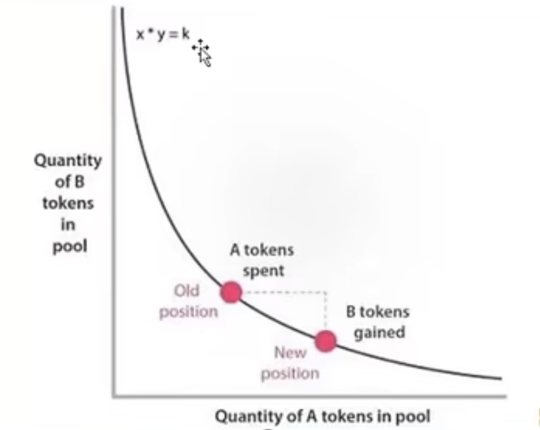
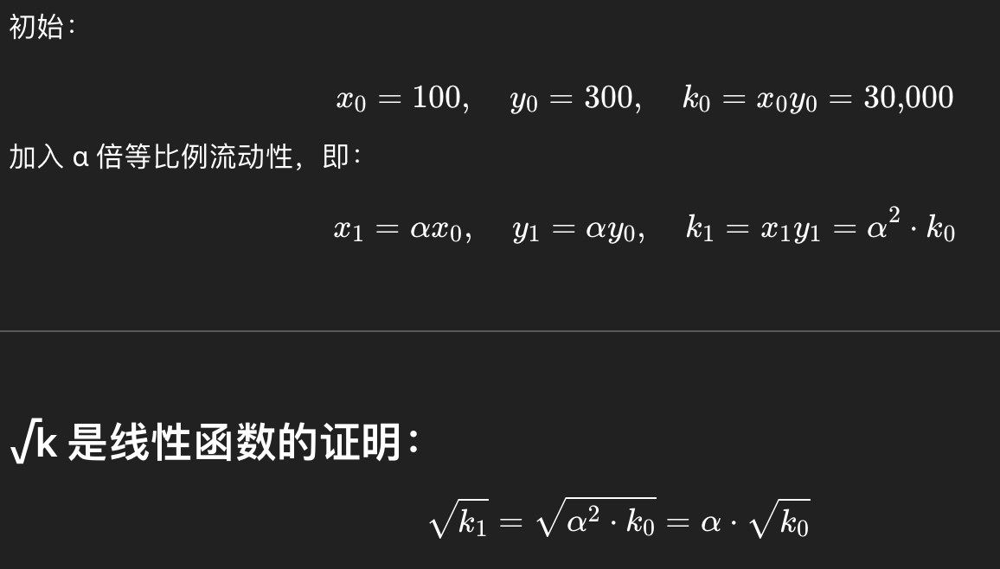
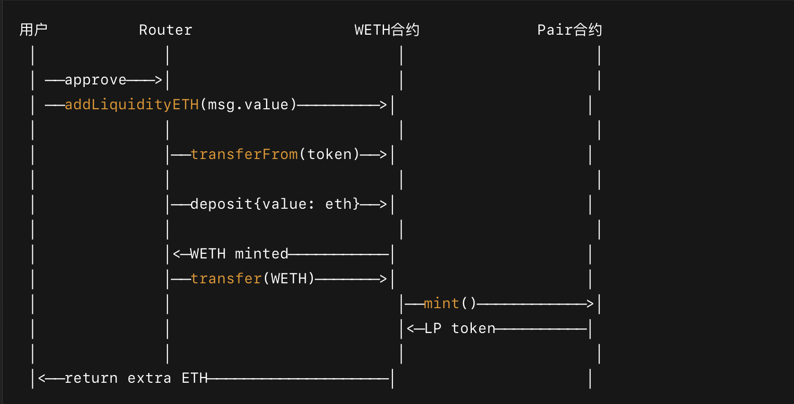
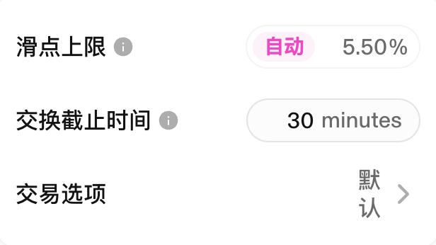
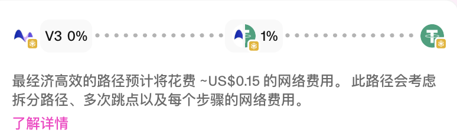

# **V1 版本**
只支持单币种与ETH的兑换，ERC20之间兑换需要通过ETH中转兑换
k = x * y
恒定乘积 x * y = k 决定价格和滑点

# **V2版本 Core 核心合约**

官方文档
https://docs.uniswap.org/protocol/V2/introduction
白皮书
https://uniswap.org/whitepaper.pdf (英文原版)
https://zhuanlan.zhihu.com/p/255190320 (中文翻译版)

- 合约改用 solidity 实现并进行了重构
- 流动性池支持任意 ERC20 币对
- 增加了收取协议费用的逻辑
- 增加了统一的交互入口 Router 合约
- 支持价格预言机 TWAP
- 支持 Flash Swaps
- 包装了ETH代币 WETH，在router 合约层面进行了处理
  0.3%的手续费，但是开关目前没有开启

核心合约

- UniswapV2Factory.sol：工厂合约  主要用于管理创建交易对
- UniswapV2ERC20.sol：LP Token 合约  主要是创建交易对合约，pair去继承这个，pair本身就是token
- UniswapV2Pair.sol：配对合约  合约的核心部分 主要是添加，移除流动性，swap 兑换

### AMM 自动做市商

流动性提供者 Liquidity Provider：投入闲置资产，提供流动性（维护 储备金池 和 流动性池稳定）

交易者 Trader： 使用一种资产兑换另外一种资产

恒定乘积自动做市算法 X * Y = K   

意味着几何平均数是恒定的

x * y = k：dx * y + x * dy = 0

=> 边际价格：dx / dy = - y / x

流动性（资产）的度量 ： sqrt（k）k 的开方，

流动性提供者 不去破坏价格和资产配比

资产交换

（x + dx）* (y - dy) =  k

当 dx 趋向于无穷小，old 与 new 点位为一点时候，就是切线 ，dx / dy 就趋向于边际价格

dx / dy = -y / x

资金池越大，相同资产交换，越接近边际价格

dx / dy = x / y   =>   dx / x  =  dy / y  =  流动性配额 d（liquidity）/ totalLiquidity

增发的量计算 d（Liquidity） = totalLiquidity * （dx / x） = totalLiquidity * （dy / y）增发的LP直接给流动性提供者

##### 为什么要用 sqrt（k）k 的开方 作为度量

    当加入 α 倍等比例流动性 时候  sqrt（k）符合线性增长，相当于池子是符合线性增长的，你加了 α 倍资产，系统告诉你池子大了 α 倍
    对于度量 可以理解为一个正方形的面积，长宽如何去变化，他的面积始终不变的，流动性提供者只是放大了这个度量值，交换者在度量不变的情况下，来改变长宽，当交换者的x，y数量趋向无穷小的时候，看作不影响整个x*y = k
    我们只是将这个度量改为sqrt（k）作为一个度量
    我们也可以使用
    xyz = k
    x1*x2*....xn  开n次方 Balancer 开n次方
    算数平均结合几何平均理念  curve项目

### LPToken 合约

#### - **mint: 添加流动性**

    (uint112 _reserve0, uint112 _reserve1,) = getReserves(); // gas savings
    // 获取交易对 pair 记录在池子内 token0 和 token1 的数量

    uint balance0 = IERC20(token0).balanceOf(address(this));
    uint balance1 = IERC20(token1).balanceOf(address(this));
    //获取 pair 合约实际拥有的 token0 和 token1 的数量，reserve是本次交易之前的数量，
    //balance是本次交易pair合约 交易对的数量 ，原因是添加流动性前先转账 token 到 pair合约

    uint amount0 = balance0.sub(_reserve0);
    uint amount1 = balance1.sub(_reserve1);
    //计算出本次添加流动性的token数量

    bool feeOn = _mintFee(_reserve0, _reserve1);
    //清算 swap 时候收取的增值收益，给平台方结账增值的 1/6收益，给平台方mint 增值部分的 LP ，增加 totalSupply
    
    uint _totalSupply = totalSupply; // gas savings, must be defined here since totalSupply can update in _mintFee
    if (_totalSupply == 0) {
    liquidity = Math.sqrt(amount0.mul(amount1)).sub(MINIMUM_LIQUIDITY);
    _mint(address(0), MINIMUM_LIQUIDITY); // permanently lock the first MINIMUM_LIQUIDITY tokens
        // 初始化池子为什么设置最小流动性，当第一次用户投入1 美金时候 1 liquidity 价值是1美金，
        // 如果用户通过转赠1w美金 再调用sync函数去重置资金池，此时 1 liquidity 就价值 1.001w美金了，
        // 此时就破坏了平衡，后续用户再去投入流动性，获得的LP都是极少数的，只有达到1w美金才有1个liquidity，而且平台获得的收益基本忽略不计了。
        // 使用最小流动性增加了这种攻击的成本
        //首次添加流动性（池子为空），使用 √(amount0 * amount1) 作为初始流动性 token 的数量，
        //然后铸造出 MINIMUM_LIQUIDITY 的 LP token 发送到 address(0)，永久锁死，防止清空池子套利
    } else {
    liquidity = Math.min(amount0.mul(_totalSupply) / _reserve0, amount1.mul(_totalSupply) / _reserve1);
        //池子已有流动性，分别计算两个 token 增发的 LP Token，取最小值。
        //（LP的计算是，根据投入的token0数量占池子中token0的数量比例，根据比例计算出 amount0 数量的 token0 可以持有的LPToken数量  。
        //根据投入的token1数量占池子中token1的数量比例，根据比例计算出对应 token1  LPToken 可以持有的数量。）此话语有歧义，需要理解LP
        //注意 token0 和 token1 的数量都是在路由route合约里面按比例计算好了，剩余的token后续会反还。这边只是计算获得的 LP
    }
    
    _mint(to, liquidity);
    // 给用户mint  对应数量交易对的 LPToken 凭证，增发LP
    
    _update(balance0, balance1, _reserve0, _reserve1);
    //更新 pair 合约池子token数量记录，及token的价格累计值
    
    if (feeOn) kLast = uint(reserve0).mul(reserve1);
    //更新平台方结账时候所用的数据    
    

####  - **burn: 移除流动性**

    移除流动性的核心部分
        
    uint _totalSupply = totalSupply; // gas savings, must be defined here since totalSupply can update in _mintFee
        
    amount0 = liquidity.mul(balance0) / _totalSupply;
        
    amount1 = liquidity.mul(balance1) / _totalSupply;
        
    根据用户持有的流动性凭证，占用总流动性的比例多少，根据这个比例去分别获取 token0 和 token1 的数量

####  - **swap: 兑换**

不是等值交换，有一部分扣除 0.3%（交易对资产增值5/6，平台拿走1/6，但是平台的部分以平台名义再次投入增加Lp，只是swap不清算这部分收益）
清算是在mint和burn时期，清算上次与本次之间的资金增值

####  - **清算 _mintFee 发生在 mint 和 burn 操作时候**

    首先要知道资产度量是 Sqrt（k）也就是Sqrt（x*y）
    
    kLast：是上次burn/mint清算完后 池子中的未开方的资产度量  uint(reserve0).mul(reserve1) = x*y
    
    rootK：是本次 池子中的资产度量  Math.sqrt(uint(_reserve0).mul(_reserve1)) = Sqrt（x*y）
    
    Lp / totalSupply = （（rootK - kLast）/ 6 ）/（kLast + （rootK - kLast） * 5 / 6）
    
    = 增量度量的 1/6（平台）  /   （上次清算的度量 + 增量度量的 5/6（用户） ）
    
    = d Sqrt(k)  / （kLast + 5 * rootK）
    
    平台收益LP  liquidity = totalSupply × (√k - √kLast) / (√kLast+√k × 5)
    
    使用平台的收益去铸造LP时候，将平台方的收益单独去铸造，实际totalSupply分母里面 对应的总的度量是需要将去平台方的

    
    address feeTo = IUniswapV2Factory(factory).feeTo();
    feeOn = feeTo != address(0);
    uint _kLast = kLast; // gas savings
    if (feeOn) {
        if (_kLast != 0) {
            uint rootK = Math.sqrt(uint(_reserve0).mul(_reserve1));
            uint rootKLast = Math.sqrt(_kLast);
            if (rootK > rootKLast) {
                uint numerator = totalSupply.mul(rootK.sub(rootKLast));
                uint denominator = rootK.mul(5).add(rootKLast);
                uint liquidity = numerator / denominator;
                if (liquidity > 0) _mint(feeTo, liquidity);
            }
        }
    } else if (_kLast != 0) {
    kLast = 0;
    }

####  - **- TWAP 时间加权平均价格**
    

    price0CumulativeLast 和 price1CumulativeLast 记录从部署到当前时刻为止，价格乘以时间的累加值 这样任何时刻，通过公式得出任意一段时间的平均价格（TWAP）

    average price = （priceCumulativeNow - priceCumulativeBefer）/ （now - befer）

    = （现在计算的价格乘以时间的累加值 - 上次计算的价格乘以时间的累加值）/ （现在时间 - 上次计算价格的时间）

    token0 的 价格乘以时间的累加值  price0CumulativeLast += reserve1/reserve0  *  timeElapsed  
    
    += price0 * timeElapsed  （token0的价格 * 时间区间）
  
    token1 的 价格乘以时间的累加值  price1CumulativeLast += reserve0/reserve1  *  timeElapsed
    
    += price1 * timeElapsed  （token1的价格 * 时间区间）

因此外部使用的时候需要去保存每次的价格乘以时间的累加值 price0CumulativeLast，要不然就更新了。这样能够防止价格瞬时操纵。如果是直接根据balanceOf（）发生价格攻击

####  - **闪电贷**

    IUniswapV2Callee(to).uniswapV2Call(msg.sender, amount0Out, amount1Out, data);
    
    uniswapV2Call 是 Flash Swap 的攻击入口， 攻击可以是
    
    跨池套利
    
    价格操控 + 借贷攻击
    
    折价买入、高价卖出
    
    如果借贷平台使用 balanceOf 获取价格，就能够操纵价格，否则只能简单套利
    
    要在 一个 tx 内完成借出 + 操作 + 归还，核心的是在逻辑内控制住 token 的流动，留利润

# **V2-periphery 路由合约 **

#### addLiquidityETH   添加 ETH / ERC20 交易对流程

    _addLiquidity(token, WETH, amountTokenDesired, msg.value, amountTokenMin, amountETHMin);
    address pair = UniswapV2Library.pairFor(factory, token, WETH);
    TransferHelper.safeTransferFrom(token, msg.sender, pair, amountToken);
    IWETH(WETH).deposit{value: amountETH}();
    assert(IWETH(WETH).transfer(pair, amountETH));
    liquidity = IUniswapV2Pair(pair).mint(to);
    if (msg.value > amountETH) TransferHelper.safeTransferETH(msg.sender, msg.value - amountETH);

    - 根据已有的储备量（reserves）计算最佳添加流动性的两种 token 的数量（amountA 和 amountB），如果新池子直接创建
    - 查找交易对合约地址
    - 将 ERC20 token 转入交易对合约
    - 将 ETH 转成 WETH
    - 将 WETH 发送到交易对合约
    - 调用交易对合约的 mint() 铸造 LP token
    - 返还多余的 ETH

#### swapExactTokensForTokens(uint amountIn, uint amountOutMin, address[] calldata path, address to,  uint deadline )  兑换

    根据输入的一种tokenA 数量amountIn 来兑换另外一种tokenB 数量 amountOutMin
    
    amountOutMin 是前端根据查询接口及滑点计算出来的数量
    
    deadline  兑换超时时间，默认30分钟
    
    path 是兑换的最佳路径 。 可能没有直接兑换路径需要前端算出最佳的token兑换路径。

#### 查询接口

- quote：根据给定的两个 token 的储备量和其中一个 token 数量，计算得到另一个 token 等值的数值
- getAmountOut：根据给定的两个 token 的储备量和输入的 token 数量，计算得到输出的 token 数量，该计算会扣减掉 0.3% 的手续费
- getAmountIn：根据给定的两个 token 的储备量和输出的 token 数量，计算得到输入的 token 数量，该计算会扣减掉 0.3% 的手续费
- getAmountsOut：根据兑换路径和输入数量，计算得到兑换路径中每个交易对的输出数量
- getAmountsIn：根据兑换路径和输出数量，计算得到兑换路径中每个交易对的输入数量

# **V3 版本 Core核心合约 **

与v2相比
- 引入了**集中流动性（Concentrated Liquidity）**机制，v2是单个币对的流动性
- 支持灵活的手续费，每个交易对可以有多个不同费率的池子，v2是固定的0.3%手续费
- 改进了价格预言机 ，v2是 基于 时间加权平均价格 TWAP
- 增加了流动性预言机
- LPToken 改为了不可互换的 NFT，v2是 ERC20
- 协议手续费治理更灵活，可调整的手续费